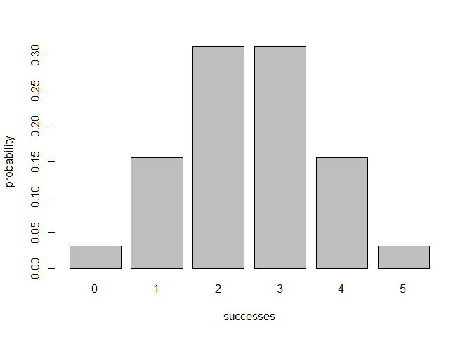
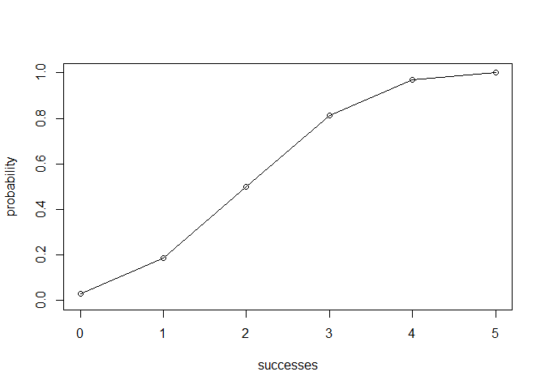

Overview
--------

The "Binomial" package implements functions for computing binomial probabilities, evaluating the binomial distribution and other measures of probability (e.g. expectation, variance). It also displays graphs of the binomial distribution and the cumulative binomial distribution.

-   `bin_choose()` computes the number of combinations "n trials choose k successes"
-   `bin_probability()` computes the binomial probability of k successes in n trials with probability p.
-   `bin_distribution()` creates a table with the binomial distribution.
-   `plot.bindis()` displays the histogram of the binomial distribution.
-   `bin_cumulative()` creates a table with the binomial distribution and the associated cumulative probabilities.
-   `plot.bincum()` the graph of the cumulative distribution.
-   `print.binvar()` displays content of a binomial random variable.
-   `print.summary.binvar()` displays the summary of measures of a binomial random variable.

How to use
----------

``` r
library(binomial)
```

``` r
# combination of 5 trials, 2 successes
bin_choose(5, 2)
#> [1] 10
```

``` r
# binomial probability: 2 successes, 5 trials, p = 0.5
bin_probability(2,5,0.5)
#> [1] 0.3125
```

``` r
# binomial distribution
dis1 <- bin_distribution(5,0.5)
dis1
#>   success probability
#> 1       0     0.03125
#> 2       1     0.15625
#> 3       2     0.31250
#> 4       3     0.31250
#> 5       4     0.15625
#> 6       5     0.03125
```

``` r
# histogram of binomial distribution
plot(dis1)
```



``` r
# binomial cumulative distribution
dis2 <- bin_cumulative(5,0.5)
dis2
#>   success probability cumulative
#> 1       0     0.03125    0.03125
#> 2       1     0.15625    0.18750
#> 3       2     0.31250    0.50000
#> 4       3     0.31250    0.81250
#> 5       4     0.15625    0.96875
#> 6       5     0.03125    1.00000
```

``` r
# plot graph binomial cumulative distribution
plot(dis2)
```



``` r
# Binomial random variable: 10 trials, p = 0.3
bin1 <- bin_variable(10,0.3)
```

``` r
# Content binomial random variable
bin1
#> "Binomial variable" 
#>  
#> Parameters 
#> - number of trials: 10 
#> - prob of success: 0.3
```

``` r
# Summary of measures of binomial random variable
binsum1 <- summary(bin1)
binsum1
#> "Summary Binomial" 
#>  
#> Parameters 
#> - number of trials: 10 
#> - prob of success: 0.3 
#>  
#> Measures 
#> - mean    : 3 
#> - variance: 2.1 
#> - mode    : 3 
#> - skewness: 0.2760262 
#> - kurtosis: -0.1238095
```
