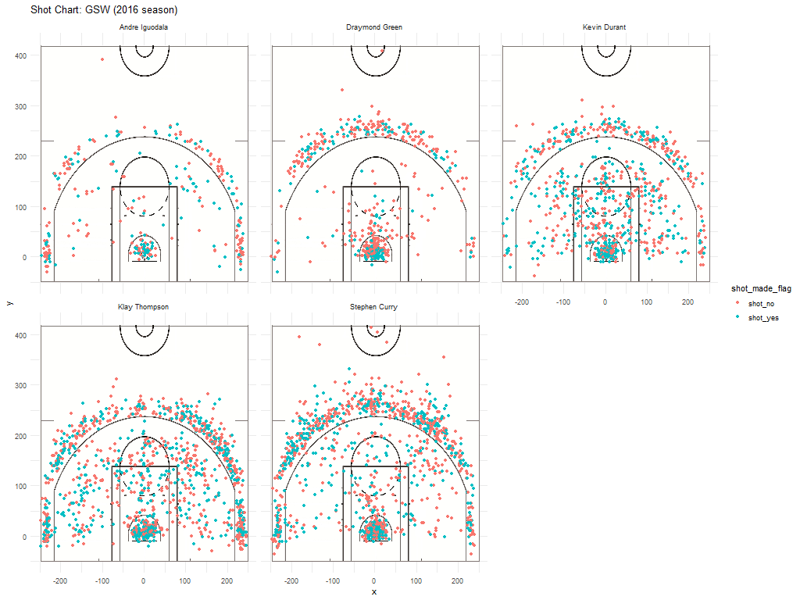

Workout 01
================
Lawrence Chang

5.1) Effective Shooting Percentage
==================================

``` r
library(dplyr)
```

    ## 
    ## Attaching package: 'dplyr'

    ## The following objects are masked from 'package:stats':
    ## 
    ##     filter, lag

    ## The following objects are masked from 'package:base':
    ## 
    ##     intersect, setdiff, setequal, union

Import shots data
-----------------

``` r
shots_data <- read.csv("../data/shots-data.csv", stringsAsFactors = FALSE)
```

3 pt effective shooting percentage
----------------------------------

``` r
# Filtering for 3 pts field goals
shots_data_three <- filter(shots_data, shot_type == "3PT Field Goal")

# grouping by name
group_by_three <- group_by(shots_data_three, name)

# table name & shots made
three_table <- summarise(
           group_by_three,
           made = sum(shot_made_flag == "shot_yes"))

# adding column for total shots
three_table$total <- c(sum(group_by_three$name == "Andre Iguodala"), sum(group_by_three$name == "Draymond Green"), sum(group_by_three$name == "Kevin Durant"), sum(group_by_three$name == "Klay Thompson"), sum(group_by_three$name == "Stephen Curry"))
                                                            

# adding perc_made column
three_table$perc_made <- three_table$made / three_table$total

# rearranging column order
three_table <- three_table[c(1,3,2,4)]

# rearranging in decreasing order of perc_made 
three_table <- arrange(three_table, desc(perc_made))
 
three_table
```

    ## # A tibble: 5 x 4
    ##   name           total  made perc_made
    ##   <chr>          <int> <int>     <dbl>
    ## 1 Klay Thompson    580   246     0.424
    ## 2 Stephen Curry    687   280     0.408
    ## 3 Kevin Durant     272   105     0.386
    ## 4 Andre Iguodala   161    58     0.360
    ## 5 Draymond Green   232    74     0.319

2 pt effective shooting percentage
----------------------------------

``` r
# Filtering for 2 pts field goals
shots_data_two <- filter(shots_data, shot_type == "2PT Field Goal")

# grouping by name
group_by_two <- group_by(shots_data_two, name)

# table name & shots made
two_table <- summarise(
           group_by_two,
           made = sum(shot_made_flag == "shot_yes"))

# adding column for total shots
two_table$total <- c(sum(group_by_two$name == "Andre Iguodala"), sum(group_by_two$name == "Draymond Green"), sum(group_by_two$name == "Kevin Durant"), sum(group_by_two$name == "Klay Thompson"), sum(group_by_two$name == "Stephen Curry"))
                                                            

# adding perc_made column
two_table$perc_made <- two_table$made / two_table$total

# rearranging column order
two_table <- two_table[c(1,3,2,4)]

# rearranging in decreasing order of perc_made 
two_table <- arrange(two_table, desc(perc_made))
 
two_table
```

    ## # A tibble: 5 x 4
    ##   name           total  made perc_made
    ##   <chr>          <int> <int>     <dbl>
    ## 1 Andre Iguodala   210   134     0.638
    ## 2 Kevin Durant     643   390     0.607
    ## 3 Stephen Curry    563   304     0.540
    ## 4 Klay Thompson    640   329     0.514
    ## 5 Draymond Green   346   171     0.494

Overall effective shooting percentage
-------------------------------------

``` r
# Filtering for 3 pts field goals
shots_data_overall <- filter(shots_data, shot_type == "3PT Field Goal" | shot_type == "2PT Field Goal")

# grouping by name
group_by_overall <- group_by(shots_data_overall, name)

# table name & shots made
overall_table <- summarise(
           group_by_overall,
           made = sum(shot_made_flag == "shot_yes"))

# adding column for total shots
overall_table$total <- c(sum(group_by_overall$name == "Andre Iguodala"), sum(group_by_overall$name == "Draymond Green"), sum(group_by_overall$name == "Kevin Durant"), sum(group_by_overall$name == "Klay Thompson"), sum(group_by_overall$name == "Stephen Curry"))
                                                            

# adding perc_made column
overall_table$perc_made <- overall_table$made / overall_table$total

# rearranging column order
overall_table <- overall_table[c(1,3,2,4)]

# rearranging in decreasing order of perc_made 
overall_table <- arrange(overall_table, desc(perc_made))
 
overall_table
```

    ## # A tibble: 5 x 4
    ##   name           total  made perc_made
    ##   <chr>          <int> <int>     <dbl>
    ## 1 Kevin Durant     915   495     0.541
    ## 2 Andre Iguodala   371   192     0.518
    ## 3 Klay Thompson   1220   575     0.471
    ## 4 Stephen Curry   1250   584     0.467
    ## 5 Draymond Green   578   245     0.424

5.2) Narrative
==============

**The Golden State Warriors Shaping the NBA Game Style**
========================================================


For years, the Golden State Warriors have been dominating the NBA and defying basketball analytics by putting impressive numbers and crushing NBA records.

Their perpetual dominance over the game has not been matched by any team throughout the NBA history, to the point that the rest of the NBA teams have tried or are trying to adopt the Warriors' prolific shooting philosophy.

What is the Golden States Warriors' secret for their success in the NBA?

They are perhaps the all-time best shooting team in NBA history, establishing the three-point line as the new two-point line in the modern basketball era.

Let's take a look at some of their wild stats from the 2016 season to see what makes them special.

Shooting Machine
----------------

According to NBA analytics, the most efficient way to score in an NBA game would be to settle for a two-point field goal. However, the Golden State Warriors proved otherwise with their three championship titles and many NBA records.



By taking a close look at the shooting charts of the five most active Golden State Warriors' players, we can see that each player takes a lot of three-point shots (shots outside the semi-circular line). Stephen Curry and Klay Thompson seem to take more three-point shots than two-point shots and are making most of them.

For the superstar core made of Stephen Curry, Klay Thompson and Kevin Durant, it makes sense for them to take a lot of three point shots since the Warriors' play style revolves around them. But, surprisingly, Andre Iguodala and Draymond Green, who are not known as shooters, take many three point shots and are converting them at a reasonable rate.

The Golden State Warriors are truly a shooting machine, taking and making so many shots outside the mid-range and behind the three-point line. That playing style has been their formula for winning games and dominating other NBA teams.

Effective shooting percentage
-----------------------------

Labeled as the best shooting team in NBA history, the Golden State Warriors display impressive numbers related to shooting.

Let's take a closer look at the crazy efficient shooting percentage of each of the five most active Warriors's players.

#### Two-point effective shooting percentage

    ## # A tibble: 5 x 4
    ##   name           total  made perc_made
    ##   <chr>          <int> <int>     <dbl>
    ## 1 Andre Iguodala   210   134     0.638
    ## 2 Kevin Durant     643   390     0.607
    ## 3 Stephen Curry    563   304     0.540
    ## 4 Klay Thompson    640   329     0.514
    ## 5 Draymond Green   346   171     0.494

All five players rank among the league's best efficient two-point shooters, even for the backcourt duo of the Warriors who tend to take more perimeter shots that are harder to hit.

Andre Iguodala, not known as a shooter, fulffils his sidekick role effectively as he has a high rate of two-point field goal conversion.

#### Three-point effective shooting percentage

    ## # A tibble: 5 x 4
    ##   name           total  made perc_made
    ##   <chr>          <int> <int>     <dbl>
    ## 1 Klay Thompson    580   246     0.424
    ## 2 Stephen Curry    687   280     0.408
    ## 3 Kevin Durant     272   105     0.386
    ## 4 Andre Iguodala   161    58     0.360
    ## 5 Draymond Green   232    74     0.319

Klay Thompson and Stephen Curry boast impressive three-point shooting numbers. They took more three points than two point shots and converted them at a successful rate (42% and 41% respectively). They are definitely not afraid of the high risk low reward ratio of settling for three point shots.

While the league average for three point field goal percentage is around 35%, all players except Draymond Green are above or well above in three-point shooting percentage efficiency.

### Overall effective shooting percentage

    ## # A tibble: 5 x 4
    ##   name           total  made perc_made
    ##   <chr>          <int> <int>     <dbl>
    ## 1 Kevin Durant     915   495     0.541
    ## 2 Andre Iguodala   371   192     0.518
    ## 3 Klay Thompson   1220   575     0.471
    ## 4 Stephen Curry   1250   584     0.467
    ## 5 Draymond Green   578   245     0.424

Kevin Durant is the most efficient scorer while taking a lot of shots. His shooting percentage (54%) is higher than the others stars Stephen Curry and Klay Thompson because he goes after two-point baskets rather than three-point goals.

In the 2016 season, Stephen Curry and Klay Thompson led the league in shots attempted, yet they displayed crazy numbers in shots made, with most of their shots coming from the three-point line.

Conclusion
----------

Unlike any other team in NBA history, the Golden State Warriors have created a unique playstyle revolving around perimeter shooting.

Their bread-and-butter for winning is the three-point shooting. The backcourt duo of Stephen Curry and Klay Thompson settle rather for three-point jumpers than the easier two-point field goals. To compensate that one dimensional playstyle, the other superstar Kevin Durant displays high shooting efficiency in both two-point and three-point field goals.

This high risk and unprecedented basketball philosophy proved to be successful for the Golden State Warriors as they dominate the NBA league and win championships. They put up impressive stats in terms of shooting and these translate into winning games. They are, if not, the greatest NBA shooting team. Other NBA teams are trying to mirror the Warriors' playstyle centered around shooting, yet they have been unsuccessful thus far.

This version of the Golden States Warriors led by perhaps all-time best shooters in NBA history are shaping the modern basketball playstyle of today and is inspiring future generations of basketball players to become foremost good in shooting.

### References

NBA shooting stats: <https://www.teamrankings.com/nba/player-stat/field-goals-attempted?rate=season-totals&season_id=213>

Golden State Warriors' information: <https://en.wikipedia.org/wiki/Golden_State_Warriors>
